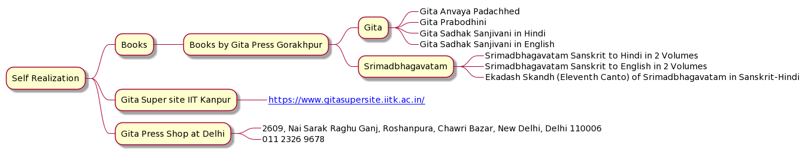

# Thirst of Self Realization: Arun, 62, Retired, NCR

## 2021-10-10

### Aim 

Enquiry about good Gita books. 

Appreciation of Podcast and website knowledge work.

### Our Knowledge Discussion Points

1. No worldly expectations. 
2. Upanishadic way of knowledge tradition. 
3. Appreciation of work not of person/name of person. 
4. All are unique and gifted. 
5. Own work. Importance of doing on work. Transcending boundaries. Flight of freedom. No burn outs. 
6. **Difference between Jungle Tiger vs Circus Tiger** 
7. **Core in Shrimadbhagawatam**

### Self Realization

**Books** 

**Books by Gita Press Gorakhpur:**

**Gita**

1. Gita Anvaya Padachhed.
 2. Gita Prabodhini
 3. Gita Sadhak Sanjivani in Hindi
 4. Gita Sadhak Sanjivani in English

**Srimadbhagavatam**

 1. Srimadbhagavatam Sanskrit to Hindi in 2 Volumes.
 2. Srimadbhagavatam Sanskrit to English in 2 Volumes.
 3. Ekadash Skandh (Eleventh Canto) of Srimadbhagavatam in Sanskrit-Hindi.

**Gita Super site IIT Kanpur**

[https://www.gitasupersite.iitk.ac.in/](https://www.gitasupersite.iitk.ac.in/)

**Gita Press Shop at Delhi**

2609, Nai Sarak Raghu Ganj, Roshanpura, Chawri Bazar, New Delhi, Delhi 110006

011 2326 9678

