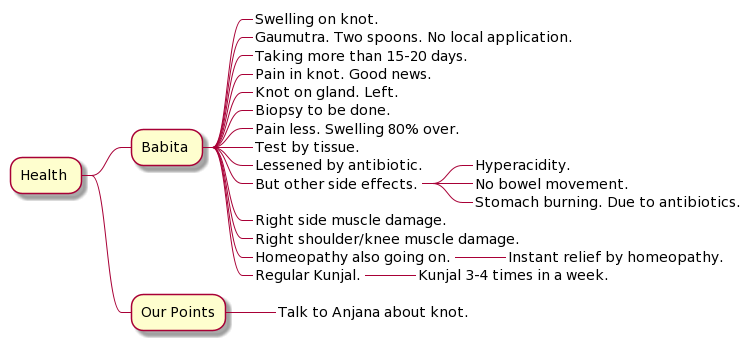
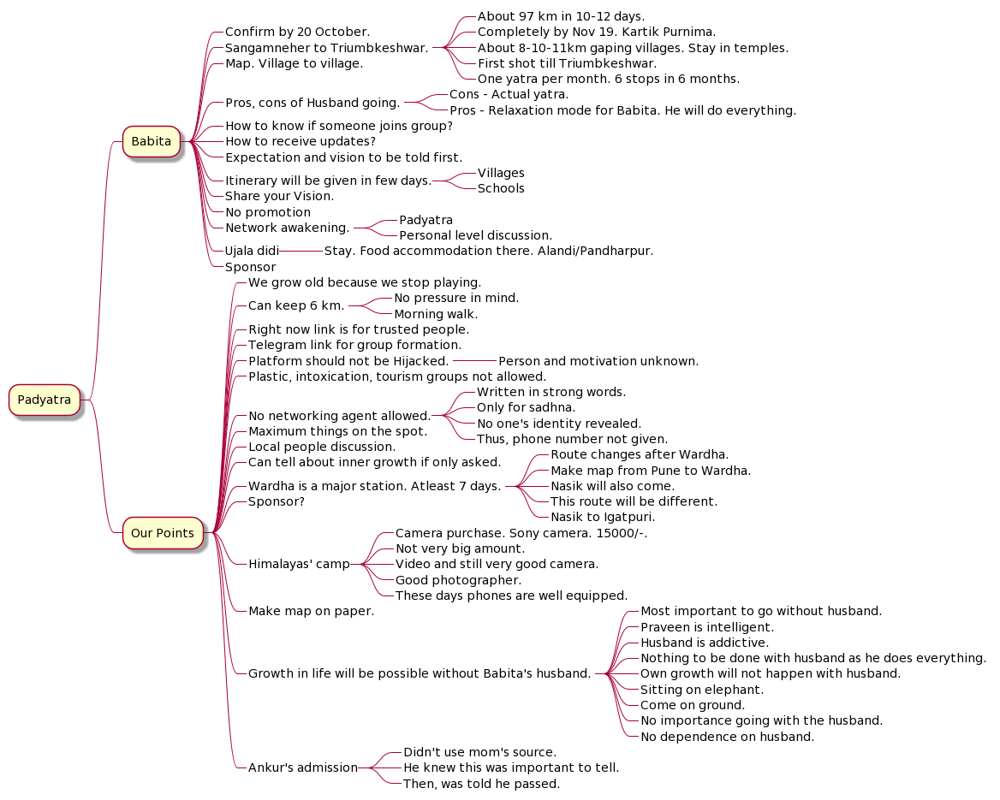

# Self sacrifice to self care: Babita, 45, pets, gardener, trekker, Mumbai

## Babita Mumbai Kitchen Garden

[Amazing kitchen garden](https://nehalsin.github.io/babita-kitchen-garden-mumbai/) by Babita ji who discovers herself everyday in her plants and pets. 

## Based on talk on 2021-10-11

### Babita

#### Health

Antibiotics.

Swelling. Knot. 

Multani mitti. Not now. 

Gaumutra. 
Two spoons. 

Taking more than 15-20 days. 

Pain in knot. Good news.

Biopsy to be done. 

Pain less. Swelling 80% over. 

Test by tissue. 

Lessened by antibiotic. But other side effects. 

Knot on gland. Left. 

No local application. 

Right side muscle damage. 

Right shoulder/knee muscle damage. 

Thinking of padyatra postponing. 

Body needs recovery. 

Can be done in December. 

Homeopathy also going on. Hyperacidity. No bowel movement. Stomach burning. Due to antibiotics. Regular kunjal. 

Instant relief by homeopathy.

Kunjal 3-4 times in a week.

#### Padyatra

December 1 padyatra. Let's wait for another week. Confirm by 20 October. (Starting from Alandi becomes 200 km. Dr Mukund. Routes. Champions of padyatra.) 

Sangamneher - Triumbkeshwar. 97 km in 10-12 days. Completely by Nov 19. Kartik Purnima. 8-10-11km gaping villages. Stay in temples. First shot till Triumbkeshwar. 
One yatra per month. 6 stops in 6 months. 

10000 steps. Target. Everyday. 

Map. Village to village. 

Pros, cons of Husband going. 
Cons: Actual yatra. 
Pros: Relaxation mode for Brahmi. He will do everything. Mataji. 
Stopped coloring hair. Hair became white. 

99% sure that won't postpone.
Pain almost gone. 
Knot there but no issues. 

How to know if someone wants to join group? How to receive updates? 

**Expectation and vision to be told first.** 

Itinerary will be given in few days. Villages. Schools. 

**Share your Vision.** 

**No promotion.** 

Some guy. Ahmedabad. Rajkot. Connection with these people. 30-35 connections. One lady. Her brother has farm in Wardha. 

Network awakening. Padyatra. Personal level discussion. 

Ujala didi. Stay. Food accommodation there. Alandi/Pandharpur. 

Sponsor.

### Our Points of Discussion

#### Health

Talk to Anjana about knot. 

Check Haemoglobin in blood for hair loss after Covid. Protein deficiency.

#### Padyatra

We grow old because we stop playing. 

**Can keep 6 km. No pressure in mind. Morning walk.** Yatra completed before breakfast. 

Right now link is for trusted people. 
Telegram link for group formation. 
Platform should not be Hijacked. 
Person of unknown and motivation unknown. 

**Plastic, intoxication, tourism groups not allowed.** 

**No networking agent allowed.** 
Written in strong words. Only for sadhna. 
No one's identity revealed. 
Thus, phone number not given. 

Maximum things on the spot. 

Local people discussion. 

Can tell about inner growth if only asked. 

Wardha is a major station. Atleast 7 days. 

Dwarka will be hot. March April will be hot. 

Triumbkeshwar is a holy place. 

Route changes after Wardha. 

Make map from Pune to Wardha. Nasik will also come. This route will be different. 
Nasik to Igatpuri. Beautiful hill station. 

Gujaratis. Naturopathy. 

Sponsor? 

Himalayas' camp. Camera purchase. Sony camera. 15000/-. Not very big amount. Video and still very good camera. 5-6 years. One can do wonders. 

Good photographer. These days phones are well equipped. 

Make map on paper. 

**Growth in life will be possible without Babita's husband.** Most important to go without Babita's husband. Praveen is intelligent. Husband is addictive. Nothing to be done with Husband as he does everything. Own growth will not happen with Babita's husband. 
Sitting on elephant. Come on ground. No importance going with Husband. No dependence on Babita's husband. 

Ankur's admission. Didn't use mom's source. He knew this was important to tell. Then told he passed. 

