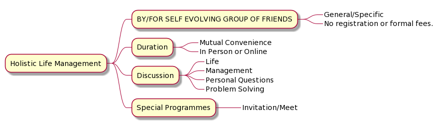

# Holistic Life Management (HLM)

## General
 
 **INTRODUCTION**

Counseling, advice and discussion on life relevant topics including health, [practical spirituality](practical-spirituality.md), tech, general/specific guidance and question. 

Our team has been into HLM for long, providing lasting help and counseling in diverse areas, even other than profession, money or professional growth. 

Life is sum total. And thus, friends to support and receive positive vibes from in dire circumstances help boost to perform with enriched wisdom. 

## Inspiring Stories

### September 2021
 1. **Quest of love & peace:** [Asha, 60, artist, lecturer, Bangalore](asha.md)
 2. **Self sacrifice to self care:** [Babita, 45, pets, gardener, trekker, Mumbai](babita.md)
 3. **Back to natural life:** [Dinesh, 40, aspiring micro-farmer, Panchkula](dinesh.md)
 4. **Classical Music Aspirant:** [Vinay, 26, Yoga, Taekwondo, Varanasi](vinay.md)
5. **Changing the world - Inspiring young minds:** [Ganesh, 45, remote Himalayan village](ganesh.md)

### October 2021 
1. **Joining Farming School:** [Sachin, 50, IT Industry, Shringeri](sachin.md)
2. **Thirst of Self Realization:** [Arun, 62, Retired, NCR](arun.md)

### February, 2022
1. **Life Changing Moment:**  [Mohan, 35, Entrepreneur](mohan.md) 
2. **Modern couple meets Bhagavat Gita:** [Sunita Ashu, 40-45, Business Family](sunitaashu.md)
3. **Fundamentals of Law:** [Anamika, 21, Law Student](anamika.md)

### March 2022
1. **Right philosophy is the crux:** [Bonita ji - Vinay, mother son duo](bonitaji-vinay.md)
2. **Be your own best friend:** [Krish, 22, Student](krish.md)

### April 2022 

1. **Live with Purpose:** [Durgesh, Mountain Resort Entrepreneur, 25, Uttarakhand](durgesh.md)
2. **Queries by a friend:** [Bonita, Actor](bonita.md)

## Join the Community

Join our [Telegram Channel](https://t.me/holisticlifemanagement) to get [moderated](moderated-channel-benefits.md) information only. 

## Voluntary Spirit Guidelines

These [GUIDELINES](https://nehalsin.github.io/voluntary-spirit-guidelines/) help you get maximum value from holistic life management.
